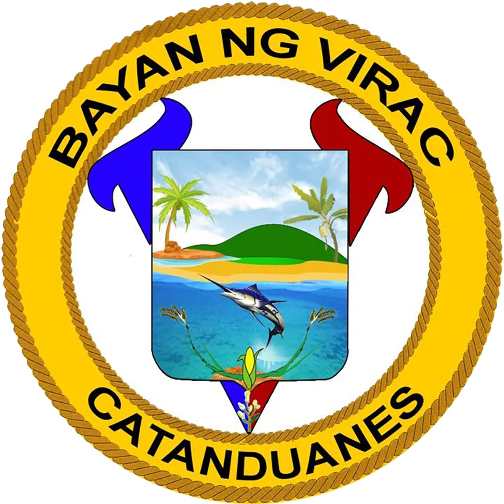

<p align="center">
  
</p>

<h1 align="center">Virac Public Market Rental and Utility Management System</h1>
<h3 align="center">RUMSYS — A Web-Based Management System for Virac Public Market</h3>

<p align="center">
  
  
  
</p>

---

## 📖 About the System

The **Virac Public Market Rental and Utility Management System (RUMSYS)** is a web-based application developed as a capstone project to digitize and automate the management of vendor stall rentals, utility billing, meter reading, and payment collection at the Virac Public Market.

The system replaces manual, paper-based processes with a centralized digital platform, enabling efficient monitoring of vendor accounts, automated bill generation, real-time payment tracking, and SMS-based communication with vendors.

---

## 🎯 Objectives

- Automate the generation of monthly rental and utility bills (electricity and water) for each vendor stall.
- Provide a self-service **Vendor Portal** where vendors can view their outstanding bills, payment history, and utility consumption analytics.
- Enable **Staff** to manage vendor accounts, record payments, and generate collection reports.
- Allow **Meter Reader Clerks** to submit monthly electricity and water readings digitally.
- Provide **Administrators** with system-wide configuration controls including billing settings, rates, and user management.
- Send automated **SMS notifications** for billing statements, overdue alerts, and payment reminders.

---

## ✨ Key Features

### 🏪 Vendor Management
- Register vendors and assign them to specific stalls and market sections.
- Store and manage vendor profiles (name, contact number, application date, profile picture).
- Staff can view and update vendor details and reassign stalls.

### 💰 Billing & Payment System
- Automated monthly bill generation for **Rent**, **Electricity**, and **Water**.
- Configurable billing rules:
  - **Early payment discount** for rent paid within the first 15 days of the month.
  - **Penalty rates** applied to overdue utility bills.
  - **Surcharge + monthly interest** compounded for overdue rental bills.
- Staff can record payments and mark bills as paid.
- Full payment history with date, amount, and bill type tracking.

### 🔌 Meter Reading Management
- Meter Reader Clerks submit monthly electricity readings per stall through a dedicated portal.
- System auto-determines the active billing period (previous or current month based on date).
- Reading **edit requests** with approval workflow (Meter Reader → Staff/Admin).
- Archive of all past readings filterable by month and market section.
- Upcoming task schedule displayed to Meter Reader Clerks.

### 📊 Reports & Analytics
- **Monthly Collection Reports**: total collections, breakdown by section and utility type, delinquent vendor list.
- **Vendor Analytics**: electricity consumption trends (last 12 months), on-time vs. late payment tracking.
- **Staff Dashboard KPIs**: collection trends, vendor distribution, utility consumption charts.
- Downloadable PDF reports.

### 📱 SMS Notifications
- Automated SMS alerts sent to vendors:
  - **Billing Statements** — upon monthly bill generation.
  - **Overdue Alerts** — for unpaid bills past due date.
  - **Payment Reminders** — periodic reminders.
  - **Password Reset OTP** — for account recovery via SMS.
- Customizable SMS templates managed by the Administrator.

### 🔔 In-App Notifications
- Real-time notification bell with unread count for all user roles.
- Mark individual or all notifications as read.

### 🔐 Authentication & Security
- Role-based access control (RBAC) with four user roles.
- Forced password and username change on first login for vendors.
- SMS-based OTP for forgot password recovery (no email required).
- **Audit Trail** — all critical system actions are logged for accountability.
- Rate limiting on administrative command endpoints.
- Back-button prevention to protect sensitive pages after logout.

### ⚙️ System Administration
- Manage system users (Staff, Meter Reader Clerk accounts).
- Configure **Rental Rates** and **Utility Rates** (per unit).
- Configure **Billing Settings** (penalty %, surcharge %, interest %, discount %).
- Set **Billing Schedules** (meter reading day, billing cut-off).
- Manage **SMS Notification Templates**.
- Review and act on meter **Reading Edit Requests**.

---

## 👥 User Roles

| Role | Portal | Access |
|------|--------|--------|
| **Vendor** | `/vendor/home` | View bills, payment history, analytics; update own credentials |
| **Staff** | `/staff` | Manage vendors, record payments, generate reports, view dashboard |
| **Meter Reader Clerk** | `/meter` | Submit meter readings, request reading corrections, view archives |
| **Admin (Super Admin)** | `/superadmin` | Full system configuration, user management, billing settings |

---

## 🛠️ Technology Stack

| Layer | Technology |
|-------|-----------|
| **Backend Framework** | Laravel 12 (PHP 8.2+) |
| **Frontend** | Laravel Blade + Livewire 3 + Vite |
| **Database** | MySQL |
| **File Storage** | Backblaze B2 (S3-compatible) |
| **PDF Generation** | Spatie Browsershot |
| **Task Scheduling** | Laravel Artisan Commands + Cron |
| **SMS Gateway** | Custom SMS Service Integration |
| **Deployment** | Docker + Nginx |

---

## 🚀 Installation & Setup

### Prerequisites
- PHP 8.2 or higher
- Composer
- Node.js & npm
- MySQL database
- A configured SMS gateway (for SMS features)

### Steps

1. **Clone the repository**
   ```bash
   git clone https://github.com/your-repo/Virac-RUMSYS.git
   cd Virac-RUMSYS
   ```

2. **Install PHP dependencies**
   ```bash
   composer install
   ```

3. **Install JavaScript dependencies**
   ```bash
   npm install
   ```

4. **Set up the environment file**
   ```bash
   cp .env.example .env
   php artisan key:generate
   ```
   Edit `.env` to configure your database, SMS gateway, and storage credentials.

5. **Run database migrations and seeders**
   ```bash
   php artisan migrate --seed
   ```

6. **Build frontend assets**
   ```bash
   npm run build
   ```

7. **Start the development server**
   ```bash
   php artisan serve
   ```
   Visit `http://localhost:8000` in your browser.

---

## ☁️ Live Deployment

The system was successfully deployed on **[Laravel Cloud](https://cloud.laravel.com)** for the capstone project's **Final Defense**.

> **Platform:** Laravel Cloud (Official Laravel Hosting Platform)  
> **Deployment Type:** Cloud-managed, auto-scaling web application  
> **Deployed by:** Capstone Group — CICT, Catanduanes State University  

### Why Laravel Cloud?

[Laravel Cloud](https://cloud.laravel.com) is the official cloud platform built by the Laravel team, offering seamless deployment for Laravel applications with:

- Zero-downtime deployments
- Managed database and queue workers
- Automatic SSL/HTTPS
- Built-in environment variable management
- Scalable compute resources

### Deployment Notes

The following environment variables were configured on Laravel Cloud for the production environment:

| Variable | Description |
|----------|-------------|
| `APP_ENV` | `production` |
| `APP_URL` | Live application URL |
| `DB_*` | Database credentials (MySQL) |
| `SMS_*` | SMS gateway API credentials |
| `AWS_*` / `B2_*` | Backblaze B2 file storage credentials |
| `ADMIN_SECRET` | Secure key for admin command endpoints |

> **Note:** The `.env.example` file in this repository documents all required environment variables for local or cloud deployment.

---

## ⏰ Scheduled Tasks (Cron Jobs)

The following Artisan commands should be scheduled to run automatically:

| Command | Description | Recommended Schedule |
|---------|-------------|----------------------|
| `billing:generate` | Generate monthly bills for all vendor stalls | 1st of every month |
| `sms:send-billing-statements` | Send billing statement SMS to all vendors | After bill generation |
| `sms:send-overdue-alerts` | Send overdue payment alerts to vendors with unpaid bills | Monthly |
| `sms:send-payment-reminders` | Send payment reminder SMS | As configured |

Add the following to your server's crontab:
```
* * * * * php /path-to-project/artisan schedule:run >> /dev/null 2>&1
```

---

## 📂 Project Structure

```
Virac-RUMSYS/
├── app/
│   ├── Http/
│   │   ├── Controllers/         # Application controllers by role
│   │   │   ├── Api/             # API controllers (Staff, Dashboard, Rates, etc.)
│   │   │   ├── Auth/            # Authentication (Login, Password Reset)
│   │   │   ├── VendorController.php
│   │   │   ├── StaffPortalController.php
│   │   │   ├── MeterReaderController.php
│   │   │   └── SuperAdminController.php
│   │   └── Middleware/
│   ├── Livewire/                # Livewire real-time components
│   ├── Models/                  # Eloquent models (User, Billing, Payment, etc.)
│   ├── Services/                # Business logic services (SMS, Audit Logger)
│   └── Console/                 # Artisan scheduled commands
├── database/
│   ├── migrations/              # Database schema migrations
│   └── seeders/                 # Database seeders
├── resources/
│   ├── views/                   # Blade templates per portal
│   │   ├── vendor_portal/
│   │   ├── staff_portal/
│   │   ├── meter_portal/
│   │   └── superadmin/
│   └── js/                      # Frontend JavaScript
├── routes/
│   ├── web.php                  # Web routes
│   └── api.php                  # API routes
└── public/                      # Publicly accessible assets
```

---

## 👨‍💻 Developers

This system was developed as a **Capstone Project** by students of **[Beyonce de Chavez, Lyra Zel Bedayo, Jean Antonette Tablizo, Jeffer Mari Zepeda/College of Information and Communications Technology - Catanduanes State University]**, Academic Year **2024–2026**.

| Name | Role |
|------|------|
| *(Beyonce de Chavez)* | *(System Analyst/Programmer)* |
| *(Lyra Zel Bedayo)* | *(Technical Writer)* |
| *(Jean Antonette Tablizo)* | *(Documentor)* |
| *(Jeffer Mari Zepeda)* | *(Lead Programmer)* |

**Adviser:** *(Mr. Erickson T. Salazar)*

---

## 📄 License

This project is developed for academic purposes as a capstone requirement. All rights reserved by the developers and the institution.

---

> *Virac Public Market Rental and Utility Management System (RUMSYS) — Empowering market administration through technology.*
